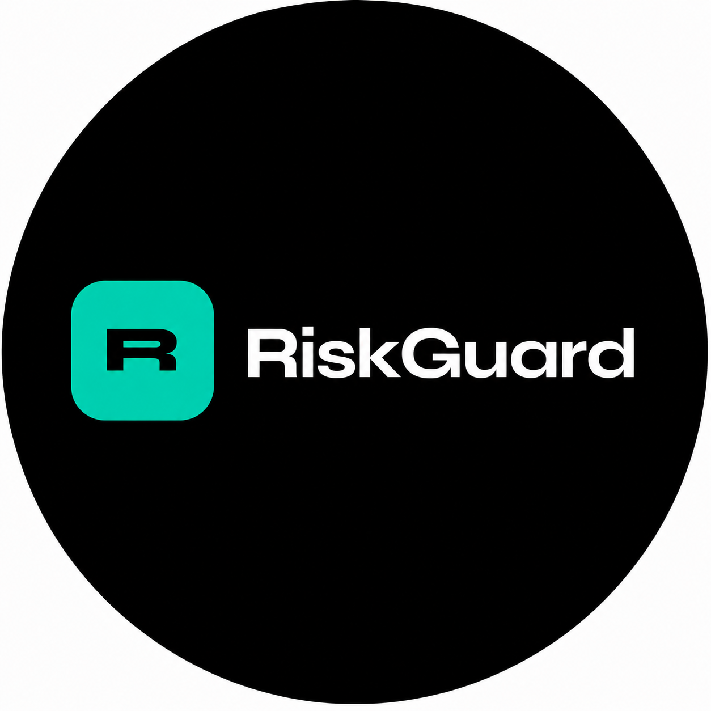

# RiskGuard

**Smart Wallet Risk Dashboard for DeFi**

Real-time risk intelligence for DeFi portfolios across Solana, Base and Ethereum.

[**Try it now →**](https://riskguard.finance/app) · No wallet connection required · Paste any address

---

## What is RiskGuard?

RiskGuard automatically detects every DeFi position in a wallet and scores the real risk of each one — smart contract safety, liquidity depth, centralization, yield sustainability, exit risk, and more. When something changes — a TVL drop, an admin key change, a peg deviation — the user gets an alert before it becomes a loss.

**The problem:** Active DeFi investors spread capital across dozens of protocols on multiple chains with no unified view of risk. Existing portfolio trackers show balances. They don't score risk, flag anomalies, or alert when something is about to go wrong.

**The solution:** A risk dashboard that reads the blockchain directly, scores each position across 9 criteria, and delivers alerts in real time via email and Telegram.

---

## Protocol Coverage

RiskGuard detects **32 DeFi protocols** through direct on-chain calls — no indexer dependency, no API intermediary. Values are validated against each protocol's native UI to the cent.

### Solana — 15 protocols

| Protocol | Detection Method | Category |
|----------|-----------------|----------|
| Kamino Farms | PDA accounts (FarmState offset 312, UserFarm offset 96) | Lending / Vaults |
| Jupiter Lend | jlToken scan via Helius DAS | Lending |
| Jupiter Native Staking | Stake Program — staker PDA identification | Liquid Staking |
| Marinade Finance | mSOL mint + native stake accounts | Liquid Staking |
| Jito | jitoSOL mint + MEV staking | Liquid Staking |
| Sanctum | INF mint detection | Liquid Staking |
| Raydium CLMM | NFT positions via Helius DAS | DEX |
| Orca Whirlpool | Token + Token-2022 scan + Orca batch API | DEX |
| Meteora DLMM | On-chain PositionV2 decode | DEX |
| Save Finance | getProgramAccounts on lending program, offset 42 | Lending |
| MarginFi / Sentora | getProgramAccounts, authority offset 40, I80F48 decode | Lending |
| Huma Finance | PST/mPST mint detection | RWA / PayFi |
| Hastra | wYLDS + PRIME receipt token detection | RWA |
| Loopscale | On-chain PDA position detection | Lending |
| Pendle | PT/YT token detection | Yield |

### Base — 10 protocols

Aave V3 · Aerodrome V3 · Uniswap V3 · PancakeSwap V3 · Morpho Blue · Moonwell (via Mamo proxy) · Compound V3 · Spark · Fluid · Extra Finance

### Ethereum Mainnet — 7 protocols

Aave V3 · Lido (stETH + wstETH) · Spark · Rocket Pool · Morpho Blue · Compound V3 · Uniswap V3

---

## Risk Model

Each position is scored **0–100** across 4 weighted dimensions:

| Dimension | Weight | What it measures |
|-----------|--------|-----------------|
| Smart Contract | 30% | Audit history, hack history, upgrade patterns, admin key concentration, operational maturity (Lindy effect), deployment verification |
| Liquidity | 25% | TVL with DeFi-calibrated thresholds ($500M+ = blue chip, <$20M = high risk), exit profile and lockup risk |
| Centralization | 25% | Admin key concentration + portfolio HHI diversification score |
| Market | 20% | Protocol ranking, yield sustainability (fees vs token emissions vs RWA) |

### Additional criteria within each dimension

- **Hack history** — recent exploits penalize the score proportionally to severity and recency
- **Operational maturity** — Lindy effect: contracts with 3+ years of clean operation on mainnet receive a bonus, conditional on TVL > $100M
- **Yield sustainability** — fees, incentives, mixed, or RWA-backed yields are classified and scored differently
- **Exit and lockup risk** — instant redemption vs delayed unstaking vs locked vaults are treated differently
- **Leveraged positions** — debt ratio and leverage multiplier apply additional penalties (a 3x position with 66% debt ratio scores significantly lower than an unleveraged position in the same protocol)

### Concentrated liquidity range status

For Uniswap V3, PancakeSwap V3 and Aerodrome V3, RiskGuard displays **in-range / out-of-range status** instead of APR estimates. Pool-level APR diverges 30%+ from actual position returns because it ignores the user's specific price range and time in-range. Range status is read directly from `slot0()` on the pool contract.

---

## Real-Time Anomaly Detection

A monitoring cron runs every **30 minutes** across all tracked protocols, watching for:

- TVL drops exceeding defined thresholds
- APY spikes suggesting protocol instability
- Admin key changes (the vector used in the Drift Protocol exploit)
- Liquidity exits suggesting informed actor movement
- Peg deviations for LSTs and stablecoins (powered by Pegana)

Alerts are delivered via **email** (Resend) and **Telegram** in real time.

---

## AI Analysis

After position detection and risk scoring, RiskGuard generates a natural-language analysis of the full portfolio using the **Claude API**. The analysis references actual positions by name, uses real values and current APY figures, and produces a specific recommendation — not generic advice.

---

## Phishing Token Detection

Contract analysis via **GoPlus Security** flags tokens with unverified source code, known malicious signatures, or patterns consistent with address poisoning attacks.

During beta testing, RiskGuard detected a live phishing token — a fake AERO token impersonating Aerodrome Finance, tagged as `Fake_Phishing77` on Basescan — in a real user's wallet. The user had never interacted with the contract. The system caught it automatically.

---

## Peg Risk Monitoring

Integration with **[Pegana](https://pegana.xyz)** provides real-time peg status for 14 LSTs and stablecoins on Solana — jitoSOL, mSOL, JupSOL, INF, USDC, USDT, and more.

Pegana measures market price vs intrinsic value (not vs $1, which is the wrong anchor for most pegged assets). When an asset enters DRIFT or DEPEG state, the position's risk score updates automatically and the user receives an alert.

---

## Technical Stack

| Layer | Technology |
|-------|-----------|
| Frontend | Next.js 16 + React 19 + TypeScript + Tailwind |
| Backend | Node.js + Express + TypeScript |
| Database | PostgreSQL + Redis (Railway) |
| Authentication | Sign-In with Ethereum (SIWE) + Sign-In with Solana (Ed25519) |
| Solana RPC | Helius |
| EVM RPC | Alchemy |
| AI Analysis | Claude API (Anthropic) |
| Email | Resend |
| Security | GoPlus Security |
| Peg Monitoring | Pegana |
| TVL Data | DeFiLlama |
| Deploy | Vercel (frontend) · Railway (backend) |

---

## Data Sources & Integrations

[Helius](https://helius.dev) · [Alchemy](https://alchemy.com) · [DeFiLlama](https://defillama.com) · [GoPlus Security](https://gopluslabs.io) · [Pegana](https://pegana.xyz) · [Anthropic Claude](https://anthropic.com)

---

## Current Status

- **Phase:** Private beta
- **Protocols detected:** 32 (15 Solana · 10 Base · 7 Ethereum)
- **Infrastructure:** Live at [riskguard.finance](https://riskguard.finance)
- **Upcoming:** Public launch with Free / Pro ($15/mo) / Whale ($49/mo) plans

---

## Try It

No wallet connection required. Paste any public address at [riskguard.finance/app](https://riskguard.finance/app) and see the full dashboard in seconds — risk scores, position detection, AI analysis, and peg status.

---

## Contact

- **X:** [@RiskGuardApp](https://x.com/RiskGuardApp)
- **Website:** [riskguard.finance](https://riskguard.finance)
- **Feedback:** feedback button in the dashboard

---

*RiskGuard is in private beta. The codebase is closed source.*
*Protocol detection logic, risk model calibration, and anomaly detection represent the core IP of the product.*

